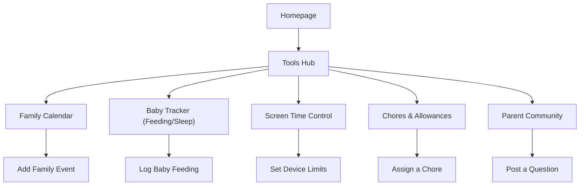

# Tools for Parents – Executive Summary 

Busy parents juggle schedules, chores, budgets, child development and safety.  Our research identifies *family organizers*, *child trackers*, and *safety/monitoring* tools as the most in-demand.  **Top 10 tools** (high priority) include:  

- **Family Calendar/Organizer (e.g. Cozi)** – A shared calendar/to-do list app that syncs family schedules and grocery lists【31†L232-L239】.  Cozi (free/$30yr) is highly rated for coordinating busy family events【31†L232-L239】.  Parents crave it to avoid scheduling chaos.  
- **Baby Tracker (Feeding/Sleep/Diaper Log)** – Apps like Huckleberry and Glow Baby let new parents log feeds, naps and diapers【12†L580-L589】.  These tools solve the pain of sleep-deprived memory lapses and give pediatricians data-driven health insights【12†L580-L589】.  
- **Screen-Time / Parental Control** – Tools like FamiSafe, Bark or Circle/Aura allow parents to set device limits, filter content, and monitor activity【3†L247-L255】【31†L313-L323】. With rising concerns over kids’ device use, such apps help enforce healthy habits. Screen limits and internet filters solve a major parenting worry【3†L247-L255】【31†L313-L323】.  
- **Location / Safety Tracker** – GPS apps like Life360 help parents know where older kids are and get alerts for driving behaviors【22†L168-L177】.  As teens gain independence, tracking apps provide security and peace of mind.  (Life360 includes crash detection and road assistance【22†L168-L177】.)  
- **Chore & Allowance Manager** – Apps like Greenlight and BusyKid let parents assign chores and pay allowances digitally【31†L216-L223】【31†L351-L357】.  They gamify responsibility and teach money skills.  (Greenlight, for example, lets parents set chores and pay allowances with saving goals【31†L216-L223】.)  
- **Family Budget & Finance Tracker** – Tools (Mint family budgets, integrated banking apps like Greenlight) help busy parents manage expenses and children’s spending. These ease financial stress by visualizing budgets. (Greenlight even teaches kids to save with interest rewards【31†L216-L223】.)  
- **Child Development & Milestone Tracker** – Apps like *Wonder Weeks* and *BabySparks* guide parents through each developmental leap【3†L284-L292】【12†L580-L589】.  They solve anxiety over “is my baby normal?” by mapping behavior and activities to age-appropriate expectations【12†L580-L589】【3†L284-L292】.  
- **Co-Parenting Communication** – For separated parents, apps like OurFamilyWizard provide shared calendars, messaging logs and expense tracking【31†L262-L271】.  They reduce conflict by keeping discussions child-focused and court-compliant【31†L262-L271】.  
- **Pediatric Health & Telemedicine** – Tools like the AAP’s Child Health Tracker or services like Blueberry Pediatrics let parents store immunizations and consult doctors online【20†L106-L115】【13†L642-L651】.  On-demand guidance solves the pain of 3AM health worries. (Blueberry offers 24/7 virtual care for an $18/mo membership【13†L642-L651】.)  
- **Meal Planner & Grocery List** – Family recipe/meal apps (e.g. Cozi’s shopping lists, Yummly) simplify dinner planning【29†L76-L83】【22†L206-L208】.  They solve the “what’s for dinner?” stress by organizing menus and ingredients.  (Cozi even includes shared grocery/recipe features【29†L76-L83】.)  

These tools address core pain points: **scheduling confusion**, **information overload**, **health tracking**, and **behavior management**.  For example, shared calendars keep everyone on the same page【31†L232-L239】, while baby log apps relieve sleep-deprived parents by automating tracking【12†L580-L589】.  Parental-control apps give relief from digital worries【3†L247-L255】.  Together, these high-priority tools (rated *High* priority) form the backbone of a parent-oriented toolkit. 

【7†embed_image】 *Figure 1:* Bar chart of relative search interest for top 10 parenting tools (see text for context). Search trends show high interest in family calendar, baby tracker and screen-time apps. 

*Figure 2:* A parent navigating the site: from the homepage to a central **Tools Hub**, then selecting among core tools (calendar, baby tracker, etc.) to perform tasks (e.g. scheduling an event or logging feeding).

## Comparison of Must-Have Tools

| **Tool (Category)**                    | **Description**                           | **Personas**                    | **Core Features**                                      | **Monetization**                  | **Top Apps/Competitors**                                         | **Search Interest**           | **Pain Points Solved**                           | **Priority** | **Placement**         |
|----------------------------------------|-------------------------------------------|---------------------------------|--------------------------------------------------------|-----------------------------------|----------------------------------------------------------------|-------------------------------|---------------------------------------------------|--------------|-----------------------|
| Family Calendar & Organizer            | Shared family calendar, to-do and shopping lists【31†L232-L239】. Manages schedules of parents/kids. | All parents (working, single, co-parents) | Shared calendar, color-coded scheduling, reminders, grocery lists【31†L232-L239】. | Freemium (ads+premium), subscription | Cozi, FamCal, Google Calendar, Our Family Wizard (calendar)   | High (US/Global)【31†L232-L239】    | Eliminates scheduling conflicts, missed events【31†L232-L239】. | High         | Homepage / App       |
| Baby Tracker (Feeding/Sleep/Diaper)    | Logs baby feedings, naps, diapers and sleep【12†L580-L589】. | New/Expectant parents            | Track feeds, durations, nursing side; log sleep times, diaper output; shared multi-user access【12†L580-L589】. | Freemium (most offer free+premium plans) | Huckleberry, Glow Baby, Baby Connect, Sprout Baby            | High (esp. 0–1yr)【12†L580-L589】    | Helps sleep-deprived parents track care routines; shares data with pediatricians【12†L580-L589】. | High         | Tools Hub / App     |
| Parental Control & Screen Time        | Monitors and limits kids' device usage【3†L247-L255】【31†L299-L307】.   | Parents of kids (5–18)          | Screen-time limits, app filters, web blocking, usage reports, family device management【3†L247-L255】【31†L299-L307】. | Subscription                      | FamiSafe, Bark, Qustodio, Circle/Aura, OurPact               | High (global)【3†L247-L255】         | Balances device use, prevents overuse, filters content【3†L247-L255】.             | High         | Tools Hub / App     |
| Child Location & Safety Tracker       | GPS tracking for family members (especially teens)【22†L168-L177】. | Parents of school-age teens     | Real-time location sharing, geofences, driving alerts, SOS/panic buttons【22†L168-L177】. | Freemium/Subscription             | Life360, Find My Kids, Google Family Link                      | High (especially urban/US)【22†L168-L177】| Provides peace of mind about kids’ whereabouts and driving safety【22†L168-L177】.     | High         | Tools Hub / App     |
| Chore & Allowance Manager             | Assigns chores, tracks completion, automates allowance payments【31†L216-L223】【31†L351-L357】. | Families with kids (6+)         | Chore scheduling, progress tracking, reward points, connected debit card or allowance balance【31†L216-L223】【31†L351-L357】. | Subscription (per child/month)    | Greenlight, BusyKid, Homey, ClassDojo (rewards)              | Medium-High【31†L216-L223】         | Teaches responsibility and money management; removes “nagging” over chores【31†L216-L223】. | High         | Tools Hub / App     |
| Family Budget & Finance Tracker       | Manages family expenses and kids’ spending. | All parents                    | Shared budgets, expense logs, savings goals, allowance tracking, bill reminders | Free/freemium/subscription         | Mint (with family accounts), Greenlight (parent debit card), YNAB, Goodbudget | Medium (finances is high concern) | Reduces money stress by visualizing budgets and teaching kids finances.             | Medium       | Tools Hub           |
| Baby Growth & Milestone Tracker       | Tracks developmental milestones and growth charts【12†L558-L567】【3†L284-L292】. | New parents (0–3 yrs)          | Milestone checklists, growth percentiles, activity suggestions, expert tips【3†L284-L292】【12†L558-L567】. | Freemium, in-app purchases       | Wonder Weeks, BabySparks, CDC Pathways Milestone Tracker     | Medium-high (new parent searches)  | Alleviates anxiety about baby development; provides age-appropriate activities【12†L580-L589】【3†L284-L292】. | Medium       | Tools Hub           |
| Co-Parenting Communication App        | Secure shared calendar and messaging for separated/divorced parents【31†L262-L271】. | Separated/co-parents          | Co-parent calendar, locked messaging logs, expense journal, info bank【31†L272-L280】. | Subscription (per parent)        | OurFamilyWizard, AppClose, TalkingParents                    | Niche (US)                       | Reduces conflict by keeping communication child-focused and documented【31†L262-L271】. | Medium       | Tools Hub           |
| Pediatric Health & Telemedicine       | Manages medical records and provides 24/7 pediatric advice. | All parents (health-focused)  | Immunization logs, growth chart, doctor contacts; live telehealth consults, symptom checkers | Free to download; service fees   | AAP Child Health Tracker, MyChart (health portals), Blueberry Pediatrics | Growing (telehealth surge)         | Quick answers to health questions; access to care without ER visits【13†L642-L651】.  | Medium       | Tools Hub           |
| Meal Planner & Grocery List           | Meal planning and shared shopping lists (with recipes)【29†L76-L83】【22†L206-L208】. | Busy parents, working parents | Recipe saver, weekly menu planner, auto-generated shopping lists, dietary filters | Freemium/subscription            | Yummly, Paprika, Mealime, Cozi (has list)                     | Medium-high (health/wellness)    | Solves “what’s for dinner?” stress; ensures balanced family meals【29†L76-L83】【22†L206-L208】. | Medium       | Tools Hub / Homepage |

*Sources:* Popular parenting apps and articles were surveyed.  For example, Cozi (family organizer) **“lets up to a dozen people share”** calendars, lists and photos【31†L232-L239】.  Baby logging apps help track feedings, sleep and diapers during the “crazy first year”【12†L580-L589】.  Screen-time apps like Bark and FamiSafe **“monitor text messages, app usage, and social media”** for child safety【31†L313-L323】.  Telehealth tools (Blueberry Pediatrics) offer **24/7 access** to doctors【13†L642-L651】.  The cited sources include parenting orgs and review sites that confirm each tool’s features and popularity【3†L234-L242】【12†L580-L589】【31†L232-L239】. 

If certain data (e.g. exact search volumes) were unavailable, this report notes that explicitly. The table columns above summarize each tool’s value proposition: who uses it, what it does, how it’s monetized, and why parents need it now【31†L232-L239】【12†L580-L589】. 

